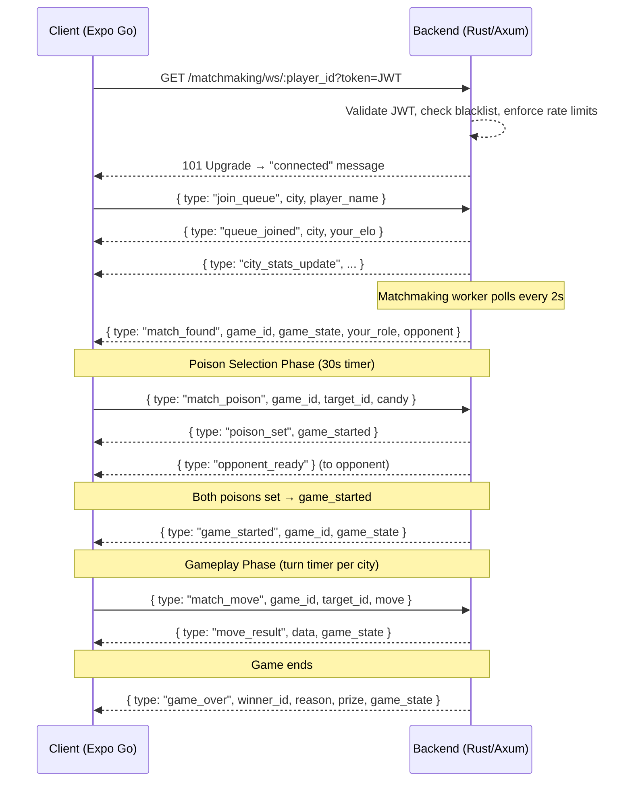

# WebSocket Protocol Specification

This document defines the full WebSocket protocol for **Poisoned Candy Duel** online matchmaking and real-time gameplay.

---

## 1. Connection Lifecycle

---

## 2. Authentication

- **Method**: JWT passed as `?token=<JWT>` query parameter on the upgrade request.
- **Validation**: Backend validates JWT signature, expiry, and checks Redis blacklist.
- **Identity Check**: JWT `sub` claim must match the `:player_id` path parameter.
- **Admission Control**: Max 3 concurrent WS connections per user, 10,000 global cap (via Redis counters).

---

## 3. Message Types

### Client → Server

| Type | Fields | Description |
|------|--------|-------------|
| `ping` | — | Heartbeat ping (client sends every 15s) |
| `select_city` | `city` | Subscribe to a city's live stats |
| `join_queue` | `city`, `player_name` | Enter matchmaking queue |
| `leave_queue` | — | Leave matchmaking queue |
| `match_poison` | `game_id`, `target_id`, `candy` | Set poison candy choice |
| `match_move` | `game_id`, `target_id`, `move` | Pick a candy during gameplay |

### Server → Client

| Type | Key Fields | Description |
|------|-----------|-------------|
| `connected` | `player_id` | Initial welcome after upgrade |
| `pong` | — | Heartbeat response |
| `queue_joined` | `city`, `your_elo` | Confirmation of queue entry |
| `queue_status` | `position`, `total_waiting` | Position update (periodic) |
| `city_stats_update` | `city`, `players_waiting`, `players_online`, `entry_fee`, `prize_pool` | Live city stats broadcast |
| `match_found` | `game_id`, `game_state`, `your_role`, `opponent` | Match created, poison phase starts |
| `poison_set` | `game_started` | Confirmation that your poison was recorded |
| `opponent_ready` | `player_id` | Opponent locked their poison (no candy revealed) |
| `game_started` | `game_id`, `game_state` | Both poisons set, gameplay begins |
| `move_result` | `data`, `game_state` | Result of a candy pick |
| `game_state_update` | `game_state` | State sync after moves |
| `timer_sync` | `seconds` | Server-authoritative timer value |
| `timer_expired` | `timed_out_player`, `game_state` | A player's turn timer expired |
| `game_over` | `winner_id`, `winner_name`, `reason`, `prize`, `is_draw`, `game_state` | Game concluded |
| `opponent_disconnected` | — | Opponent lost connection |
| `game_reconnect` | `game_id`, `your_role`, `opponent`, `game_state` | Reconnected to an active match |
| `game_cancelled` | — | Game was cancelled |
| `poison_auto_picked` | `message` | Server auto-selected poison due to timeout |
| `error` | `message` | Error message |
| `matchmaking_error` | `message` | Queue-specific error |

---

## 4. Heartbeat Protocol

- **Client** sends `{ type: "ping" }` every **15 seconds**.
- **Server** responds with `{ type: "pong" }`.
- If no pong is received within **5 seconds**, the client closes the socket and triggers reconnection.
- Server-side: no explicit server-initiated ping (relies on client pings to detect liveness).

---

## 5. Reconnection Logic

1. On unexpected close (code ≠ 1000), client attempts reconnection with **exponential backoff**: 1s, 2s, 4s, 8s, 16s.
2. Max **5 attempts** before giving up.
3. Each reconnect attempt fetches a **fresh JWT** from `authStore`.
4. If the token is empty/null, reconnection is **skipped** (guest users cannot reconnect).
5. On reconnect, the server checks for an **active game** in the database. If found, it sends a `game_reconnect` message with the full game state.

---

## 6. Timer Management

### Poison Selection Timer
- **Duration**: 30 seconds (all cities).
- **Timeout**: Server auto-picks a random poison candy for the player.
- If both poisons are now set, the game transitions to `Playing` and both players receive `game_started`.

### Turn Timer (city-specific)
| City | Timer |
|------|-------|
| Dubai | 30s |
| Cairo | 20s |
| Oslo | 10s |

- **Timeout during gameplay**: The timed-out player **forfeits** the game. Server sends `game_over` with `reason: "timeout"`.
- **Financial settlement**: Atomic DB transaction awards prize to winner and records stats.

---

## 7. Security Measures

- **Message size limit**: 32KB (rejected at WebSocket frame level), 4KB (rejected at handler level).
- **Rate limiting**: 5 messages per 5 seconds per player (via Redis).
- **Token blacklist check**: Revoked tokens are rejected at connection time.
- **Poison secrecy**: Server never forwards the actual poison candy to the opponent — only sends `opponent_ready`.
- **State sanitization**: `for_viewer(player_id)` hides the opponent's poison from game state payloads.

---

## 8. Known Gaps & Missing Features

### Currently Missing

1. **Guest Online Play**: Guests have no JWT token, so they cannot open a WebSocket. There's no guest-token flow (backend's `/auth/guest` endpoint exists but the frontend doesn't use it for WS).
2. **Server-Initiated Ping**: The server doesn't ping the client. If the client freezes (app backgrounded on iOS), the server doesn't detect it until the turn timer fires.
3. **Spectator Mode**: No support for watching live games.
4. **Chat/Emotes**: No in-game communication channel.
5. **Rematch via WS**: Rematch currently re-initializes via REST `initGame`, not via the existing WS connection.
6. **Queue Position Updates**: The `queue_status` message type is defined but never actively sent by the matchmaking worker — players only see the initial queue state.
7. **ELO Display**: The client receives `your_elo` in `queue_joined` but doesn't display it.

### Recommended Improvements

1. **Implement Guest Tokens**: Call `/auth/guest` on app launch for guest users so they receive a valid JWT for WS connections.
2. **Server-Side Ping**: Add a periodic server ping (every 30s) to detect stale connections faster.
3. **Queue Position Broadcast**: Have the matchmaking worker broadcast `queue_status` to all queued players every 5s.
4. **Background App Detection**: Use `AppState` listener in React Native to gracefully disconnect WS when the app is backgrounded and reconnect on foreground.
5. **Rematch over WS**: Send a `rematch_request` / `rematch_accepted` message pair to avoid re-creating the entire game flow.
